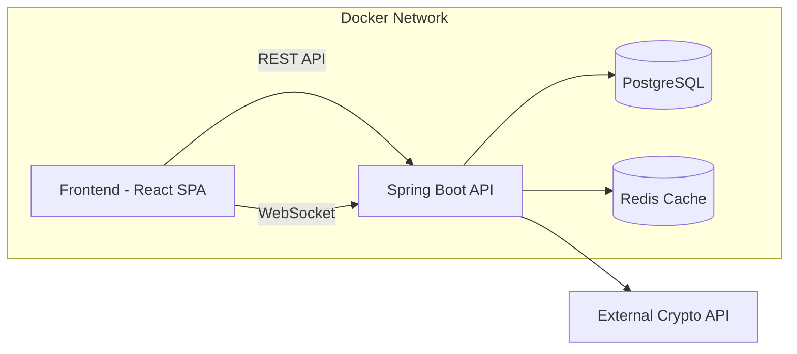
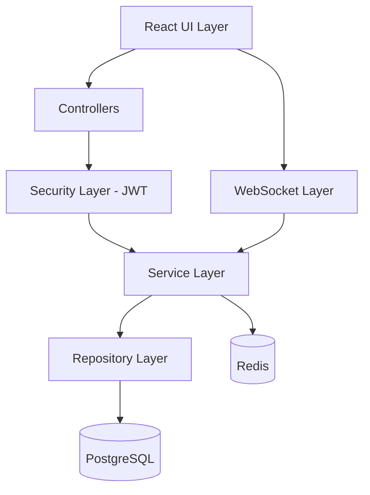
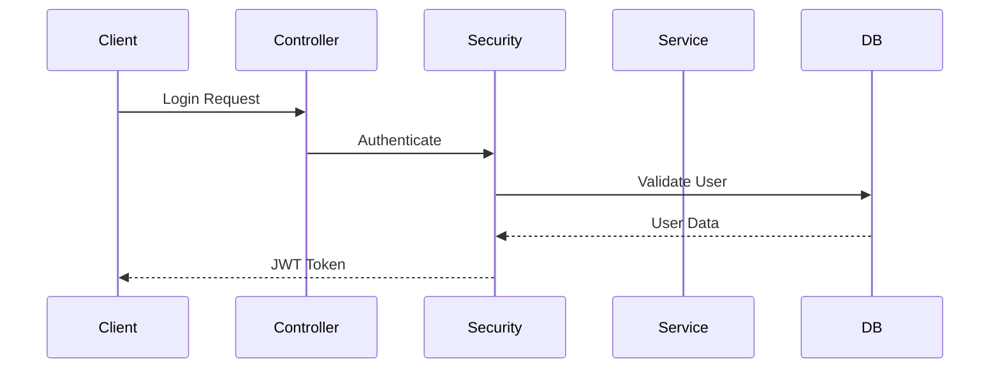
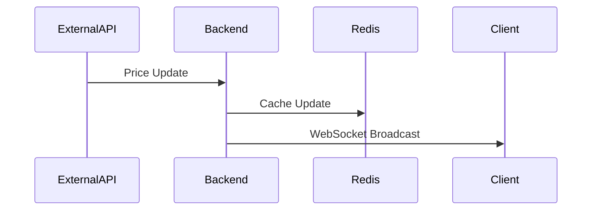
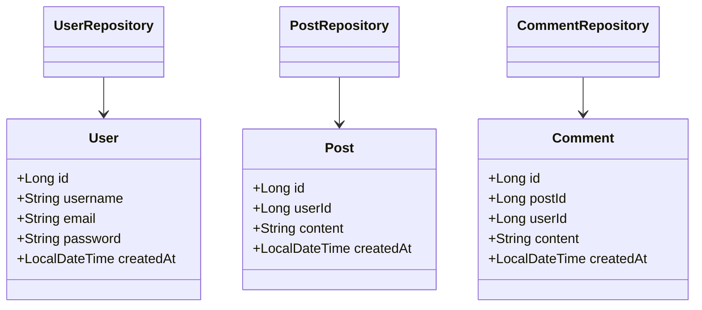
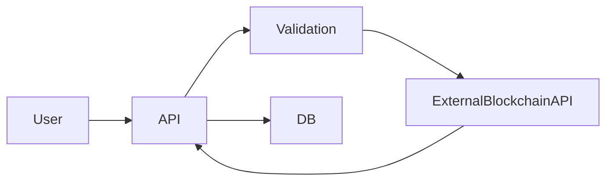
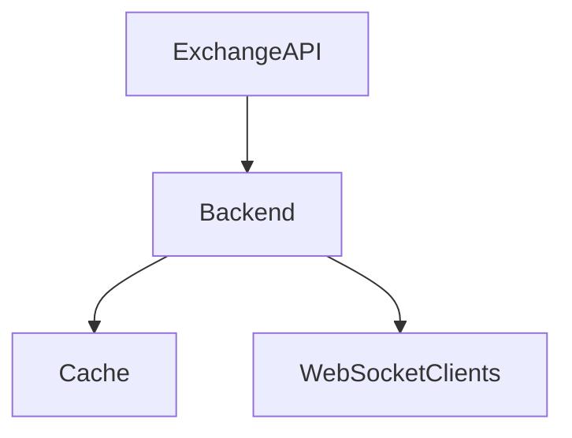
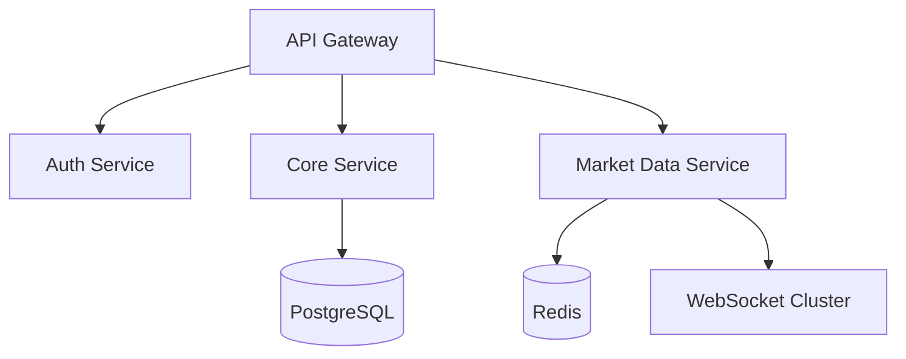

# Исследование архитектурного решения

# CryptoFlow --- Социальная сеть для трейдеров

------------------------------------------------------------------------

# Часть 1. Проектирование архитектуры (To Be)

## 1. Тип приложения

**CryptoFlow** --- это высоконагруженное веб-приложение (социальная сеть
для трейдеров) со следующими характеристиками:

-   Тип: Web Application (SPA + REST API + WebSocket)
-   Архитектурный стиль: Client-Server
-   Архитектурный паттерн: Многослойная архитектура (Controller →
    Service → Repository → DB)
-   Real-Time: WebSocket
-   Масштабируемость: Горизонтальная (Docker + Kubernetes в будущем)

------------------------------------------------------------------------

## 2. Стратегия развёртывания

### Контейнерная архитектура

### Компоненты:

-   Frontend (React)
-   Backend (Spring Boot)
-   PostgreSQL
-   Redis (кеширование)
-   WebSocket Server
-   Интеграция с внешними API бирж

------------------------------------------------------------------------

## 3. Архитектурная схема приложения (To Be)

------------------------------------------------------------------------

## 4. Сквозная функциональность

### 4.1 Аутентификация

### 4.2 Обновление курса валют (Real-Time)

## 5. Показатели качества (Quality Attributes)

Для обеспечения надежности и удобства работы трейдеров, система должна соответствовать следующим показателям качества:

| Показатель | Целевое значение | Обоснование |
| :--- | :--- | :--- |
| **Доступность** | 99.9% (Three nines) | Крипторынки работают 24/7. Трейдеры должны иметь доступ к своим данным и котировкам в любое время. Простои ведут к финансовым потерям пользователей и оттоку аудитории. |
| **Производительность** | Время ответа API < 200 мс (p95) | Пользовательский интерфейс должен обновляться плавно. Задержки в отображении цены или отправке поста делают приложение неконкурентоспособным. |
| **Масштабируемость** | Поддержка пиковых нагрузок (x10 от средней) | Во время волатильности рынка количество активных пользователей резко возрастает. Система должна выдерживать всплески без деградации. |
| **Безопасность** | Соответствие OWASP Top 10 | Приложение работает с финансовыми данными (привязка кошельков). Необходимо защитить пользователей от XSS, CSRF, SQL-инъекций и перехвата сессий. |
| **Согласованность данных** | Сильная согласованность для транзакций | Балансы кошельков, лайки и комментарии не должны теряться или дублироваться. Для ленты постов допустима конечная согласованность. |
| **Надежность** | Автоматическое восстановление после сбоев < 5 мин | При падении сервисов система должна автоматически перезапускаться, не теряя данные (Self-healing). |

## 6. Тип развертывания (Deployment Strategy)

Выбор стратегии развертывания обусловлен требованиями к доступности и необходимости частых обновлений.

1.  **Базовая инфраструктура:** Контейнеризация (Docker).
2.  **Оркестрация:** Kubernetes (K8s) для production-среды.
3.  **Стратегия развертывания:** Rolling Update (постепенное обновление).
    - *Обоснование:* Позволяет обновлять приложение без остановки сервиса. Kubernetes постепенно заменяет старые поды новыми, проверяя их работоспособность.
4.  **Окружения:**
    - **Dev:** Локальные машины или Docker Compose.
    - **Staging:** Окружение, идентичное production, для финального тестирования.
    - **Production:** K8s кластер с мультизональным размещением.

### Схема развертывания (Deployment Diagram)

```mermaid
flowchart TD
    subgraph "CI/CD Pipeline"
        A[Код] --> B[Сборка]
        B --> C[Тесты]
        C --> D[Сборка Docker образа]
        D --> E[Реестр контейнеров]
    end

    subgraph "Production Kubernetes"
        F[Ingress]
        G[Frontend Service]
        H[Backend API Service]
        I[WebSocket Service]
        
        subgraph "Поды приложений"
            J[Frontend Pods]
            K[Backend Pods]
            L[WebSocket Pods]
        end
        
        M[(PostgreSQL)]
        N[(Redis)]
    end

    E --> F
    F --> G
    F --> H
    F --> I
    G --> J
    H --> K
    I --> L
    
    K --> M
    K --> N
    L --> N
```

------------------------------------------------------------------------

# Часть 2. Анализ архитектуры (As Is)

## Реализовано к 1 спринту:

-   Спроектирована БД
-   Созданы Entity
-   Базовая структура Spring Boot
-   Настроено подключение к PostgreSQL

------------------------------------------------------------------------

## Диаграмма классов (As Is)

------------------------------------------------------------------------

# Часть 3. Сравнение и рефакторинг

## 1. Сравнение To Be и As Is

### Реализовано:

-   Структура пакетов
-   Entity слой
-   Подключение к БД

### Не реализовано:

-   JWT безопасность
-   WebSocket
-   Redis кеширование
-   Интеграция с биржами
-   Привязка криптокошелька

------------------------------------------------------------------------

## 2. Основные проблемные зоны

### 1. Привязка криптокошелька

Риски: - Валидация адресов - Безопасность хранения - Проверка владения
кошельком

------------------------------------------------------------------------

### 2. Обновление курса валют

Риски: - Высокая нагрузка - Частота обновлений - Масштабируемость
WebSocket соединений

------------------------------------------------------------------------

## 3. Рекомендованный рефакторинг

### Архитектура Target (Production Ready)

------------------------------------------------------------------------

# Вывод

CryptoFlow имеет хорошую базовую архитектурную основу (As Is), но для
выхода в production требуется:

-   Реализация JWT и Security Layer
-   Внедрение Redis
-   Настройка WebSocket инфраструктуры
-   Масштабирование через контейнеризацию
-   Интеграция с криптобиржами

Архитектура To Be ориентирована на real-time взаимодействие,
масштабируемость и безопасность.
